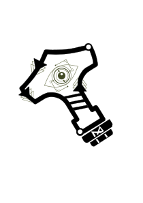

# THÖR-MAGNI Challenge 
[](https://zenodo.org/doi/10.5281/zenodo.10407222)
[](https://magni-dash.streamlit.app)

<span style="font-size:2em;">Results will be displayed on the [Leaderboard](https://schrtim.github.io/lhmp-thor-magni-challenge/leaderboard/leaderboard.html)</span>



## About this repository

This repository is for you if you want to partake in the THÖR-MAGNI challenge.
Develop, train and test your own methods with the dataset.

For all this we provide you with a comprehensive individual repository, that
contains a sample dataloader. Furthermore the repsoitory describes everything you need to know about the handling of the THÖR-MAGNi data.

## 1. Checkout the Benchmark repo for dataloaders, sample models and a predifned train/test split

[**BENCHMARK REPO**](https://github.com/tmralmeida/icra-magni-benchmark)

## 2. Submission Format

You train and develop your method locally and generate prediction files, that can be packaged and submitted to our challenge.

### 2.1. Information for the user

Submissions to our challenge are only to be made in [**.npy** format](https://numpy.org/devdocs/reference/generated/numpy.lib.format.html).

We provide a sample jupyter notebook called **run_simple_cvm** that demonstrates the format for predictions.

The structure of the predictions file is as follows:

[
- `predictions_scenario_1` (numpy array): Array of predicted trajectories for the first scenario.
  - `trajectory_1` (numpy array): Predicted trajectory for the first scenario.
    - `time_step_1` (numpy array): Coordinates (x, y) at time step 1.
    - `time_step_2` (numpy array): Coordinates (x, y) at time step 2.
    - ...
    - `time_step_N` (numpy array): Coordinates (x, y) at the final time step.
  - `trajectory_N` (numpy array): Predicted trajectory for the first scenario.
    - `time_step_1` (numpy array): Coordinates (x, y) at time step 1.
    - `time_step_2` (numpy array): Coordinates (x, y) at time step 2.
    - ...
    - `time_step_N` (numpy array): Coordinates (x, y) at the final time step.
- `predictions_scenario_N` (numpy array): Array of predicted trajectories for the Nth scenario.
  - ...

]

### 2.2. Adjust submission metadata

The repositories main directory contains a **config.yml** file.
Here you can adjust your team name and specifiy your method.
As well as specify the name of your prediction file that you want to upload to the challenge as a prediction in the next step.

## 3. How to test a prediction

To participate in this challenge, follow these steps:

1. Fork this repository to your own GitHub account.
2. Clone the forked repository to your local machine.
3. Create a conda environment using the following command (replace env_name with the name you want)
```
conda create --name <env_name> python=3.10.8 && conda activate <env_name> && pip install -r requirements.txt
```

3. Copy your submission_file.npy in the submissions folder and package it. 
(NOTE: This will use the metadata you specified in config.yml)

```
python package_submission.py
```

4. To test your challenge results, you can the processing scrpt locally. This will print the leadrboard entry for the previosuly packaged submission.
```
python challenge_processing_script.py
```
## 4. Make a submission to our challenge 

<span style="font-size:1.5em;">**Please proceed only with these steps if you want to submitt your final results!**</span>


4. Commit and push ONLY the *submission.npy* file to your forked repository.
5. Create a pull request to submit your *submissions.npy* file to the **challenge branch**. Your pull request will be inspected by one of our admins and approved if there are no outstanding issues.

## 5. Terms and Conditions

Note that the ground truth test annotations are provided in the data loader. This is because they match the ground truth of the original THÖR-MAGNI data, which is readily available. We trust participants to not utilize these unethically, especially as we will be inviting the top participants to present their work at our 2024 ICRA workshop and will review submissions accordingly. For participation in the workshop, only submissions provided before **TBA** will be considered. Top performers will then be contacted to validate their approaches and provide instructions for submitting their writeup for the **TBA** workshop.

Namely, we expect these train/val/test paradigms to be followed:

## Contact

If you have questions or remarks regarding this challenge, please contact one of our team members:
- [Tim Schreiter](http://github.com/schrtim)
- [Janik Kaden](http://github.com/janikkaden)
- [Tiago Almeida](http://github.com/tmralmeida)

## About the dataset

The THÖR-MAGNI dataset is a large-scale collection of human and robot navigation and interaction data. THÖR-MAGNI offers diverse navigation styles of both mobile robots and humans engaged in shared environments with robotic agents, featuring multi-modal data for a comprehensive representation. THÖR-MAGNI serves as a valuable resource for training activity-conditioned motion prediction models and investigating visual attention during human-robot interaction.

To further support researchers, THÖR-MAGNI comes with a dedicated set of user-friendly tools, including a [dashboard](https://magni-dash.streamlit.app) and the specialized Python package [thor-magni-tools](https://github.com/tmralmeida/thor-magni-tools). These tools streamline the visualization, filtering, and preprocessing of raw trajectory data, enhancing the accessibility and usability of the dataset. By providing these resources, we aim to equip researchers with versatile and efficient tools to navigate, analyze, and extract valuable insights from the dataset.